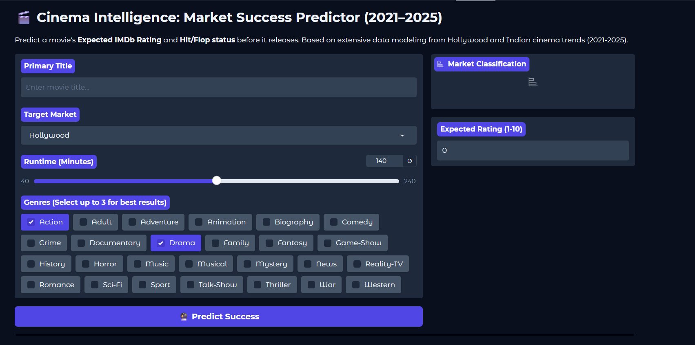
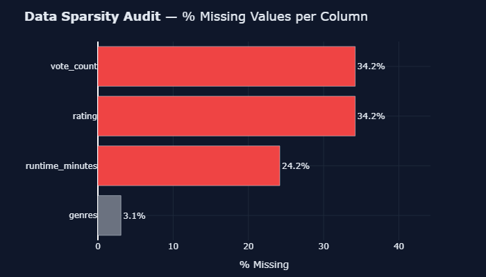
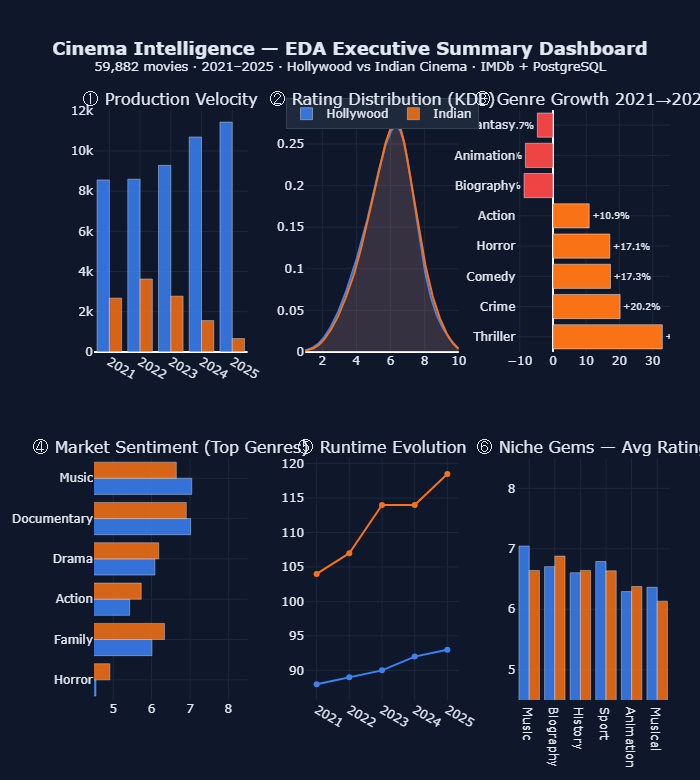

# 🎬 Cinema Intelligence: Market Success Predictor (2021–2025)



## Overview

**Cinema Intelligence** is an end-to-end data science portfolio project designed to predict a movie's **Expected IMDb Rating** and **Hit/Flop status** before its release. Leveraging a robust dataset of 59,905 movies spanning from 2021 to 2025, the pipeline analyzes intricate metadata across the Hollywood and Indian cinema markets.

This project encompasses the full machine learning lifecycle: from data acquisition, rigorous integrity auditing, and exploratory analysis, to advanced feature engineering, predictive modeling, and model deployment on Hugging Face Spaces via Gradio.

## Key Features

- **Dual-Market Focus:** Specialized regional-based segmentation distinguishing Hollywood and Indian cinema for accurate audience profiling.
- **Predictive Power:**
  - _Expected Rating:_ Predicted using an optimized LightGBM Regressor.
  - _Hit/Flop Status:_ Classified using a robust Random Forest Classifier.
- **Production-Grade Data Pipeline:** Asynchronous TMDb enrichment workflow and reliable data cleaning from a PostgreSQL backend.
- **Interactive Web Interface:** A deployed Gradio application designed for intuitive user interaction and real-time prediction.

## Repository Structure

```text
├── hf/
│   ├── app.py                     # Gradio application script for Hugging Face deployment
│   ├── models/                    # Serialized machine learning models (LightGBM, Random Forest)
│   ├── preprocessors/             # Saved artifacts (StandardScaler, MultiLabelBinarizer)
│   └── requirements.txt           # Deployment dependencies
├── notebooks/
│   ├── 01_Data_Aquisition.ipynb   # PostgreSQL connection, IMDb/TMDb data ingestion, and integrity audit
│   ├── 02_EDA.ipynb               # Professional-grade Exploratory Data Analysis with Plotly
│   ├── 03A_Feature_Engineering.ipynb # Data splitting, handling missing values, and categorical encoding
│   ├── 03B_Feature_Engineering.ipynb # Feature scaling and Parquet dataset generation
│   └── 04_Data_Modeling.ipynb     # Model training, hyperparameter tuning, and evaluation
├── data/                          # Processed analytics and ML-ready datasets (.parquet)
├── images/                        # Assets and charts used for documentation
└── README.md                      # Project documentation
```

## Data Science Pipeline Breakdown

### 1. Data Acquisition & Health Audit (`01_Data_Aquisition.ipynb`)

- Extracted and combined data from IMDb datasets and an internal `cinema_intelligence` PostgreSQL database.
- Implemented robust regional-based logic to segment 48,595 Hollywood and 11,310 Indian movies.
- Handled outliers, normalized external IDs, and applied fixes for runtime anomalies.

### 2. Exploratory Data Analysis (`02_EDA.ipynb`)

- Conducted rigorous statistical testing to identify market-specific archetypes.
- Evaluated dataset sparsity, uncovering trends in missing runtimes and rating coverages (particularly noticing sparsity in unreleased 2025 titles).
- Synthesized actionable insights via interactive Plotly visualizations.



### **EDA Summary**



### 3. Feature Engineering (`03A` & `03B_Feature_Engineering.ipynb`)

- Chronological data splitting applied to prevent data leakage.
- Generated powerful engineered features: `language_quality_score`, `genre_density`, and `votes_per_minute`.
- Employed `StandardScaler` for numeric scaling and `MultiLabelBinarizer` for genre binarization.
- Final feature matrices exported cleanly to `.parquet` format.

### 4. Modeling & Evaluation (`04_Data_Modeling.ipynb`)

- Built and evaluated multiple baselines.
- **Regression:** Tuned a LightGBM regressor to effectively predict `averageRating`.
- **Classification:** Trained a Random Forest classifier to categorize movies into Hit/Flop classifications.
- Serialized optimal models and preprocessor objects via `joblib` for deployment readiness.

### 5. Deployment (`hf/app.py`)

- Integrated inference scripts, ML models, and scalers into a unified, lightweight pipeline.
- Built a responsive and aesthetically pleasing user interface using the `Gradio` framework.
- Deployed successfully on Hugging Face Spaces for real-time portfolio demonstration.

## How to Run Locally

1. **Clone the repository** and navigate to the project root.
2. **Install dependencies**:
   ```bash
   pip install -r hf/requirements.txt
   ```
3. **Run the Gradio App**:
   ```bash
   python hf/app.py
   ```
4. Access the web interface at `http://127.0.0.1:7860`.

## Technical Limitations

- **Hardware Profile:** Models are optimized to run on standard CPU environments without requiring GPU acceleration.
- **Baseline Assumptions:** The predictions assume a baseline organic reach (normalized at ~1000 votes) and standardized theatrical release windows. Unprecedented viral marketing trends may fall outside the models' capture range.

---
